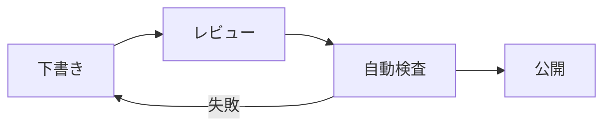

図、表、数式、画像は情報を圧縮できますが、Markdownの移植性とアクセシビリティを損ねやすい領域でもあります。**本文だけでも結論が分かるように書き、視覚要素は理解を補強するものとして配置する**のが基本です。

## 表は比較に限定する

表は、同じ属性を複数の対象で比べるときに向いています。長文、手順、段落、ネストしたリストをセルに入れるとモバイルで読みにくくなります。

| 方式        | 長所                           | 注意点                             |
| ----------- | ------------------------------ | ---------------------------------- |
| 表          | 属性を横並びで比較できる       | 列が多いと横スクロールが必要になる |
| 箇条書き    | 画面幅に強く、手順を書きやすい | 横断比較には不向き                 |
| 見出し+段落 | 判断背景を丁寧に説明できる     | 一覧性は下がる                     |

表には「何を比較している表か」が分かる直前の導入文を置き、列名だけで意味が通じるようにします。

## Mermaidで構造を共有する

VS
Codeの組み込みMarkdownプレビューは、`mermaid`コードフェンス内の図を描画できます。[1]
GitHubや静的サイト側での対応状況は異なるため、最終公開先で必ず確認してください。



図には前後で説明を付けます。図だけを置いて「何を示しているか」を読み手に推測させないでください。また、色だけで状態を区別しない、ノード名を短くする、矢印の向きを一貫させるといった配慮が必要です。

## 数式は目的と代替を考える

VS CodeのMarkdownプレビューはKaTeXによる数式レンダリングをサポートします。[1]
例えば、インライン数式は次のように書けます。

```md
二乗は $x^2$ です。
```

ブロック数式には`$$`を使えます。

```tex
$$
\sum_{i=1}^{n} i = \frac{n(n+1)}{2}
$$
```

数式を使うときは、式の直前または直後に「何を計算する式か」「変数が何を意味するか」を説明してください。数式レンダリングに対応しない公開先では、プレーンテキストの説明または画像化した式が必要になることがあります。

## 画像の代替テキスト

Markdown画像の角括弧内は装飾ではなく代替テキストです。画像が見えない状況でも、読者が必要な情報を得られるように説明します。

```md

```

次のような抽象的なテキストは避けます。

```md

```

画面キャプチャの場合は、画面名、重要な状態、読者が確認すべき値を含めます。本文ですでに完全に説明している装飾画像は、代替テキストを空にする選択肢もありますが、意味のある情報を含む画像には必ず説明を付けます。markdownlintのMD045は画像の代替テキスト欠落を検出できます。[2]

## 画像ファイルの置き方

このリポジトリでは、公開用画像を`public/images/`に置き、本文から相対または公開パスで参照します。VS
Codeでは、ワークスペース設定の`markdown.copyFiles.destination`を使って貼り付け画像の保存先を整えることができます。[1]

高解像度の画像を無批判にコミットすると、リポジトリとサイト表示が重くなります。必要な範囲へトリミングし、用途に応じてWebP、PNG、SVGを選び、著作権・ライセンス・個人情報を確認してください。

## 参考資料

[1]:
  https://code.visualstudio.com/docs/languages/markdown
  'Visual Studio Code: Markdown'
[2]: https://github.com/DavidAnson/markdownlint 'markdownlint'
